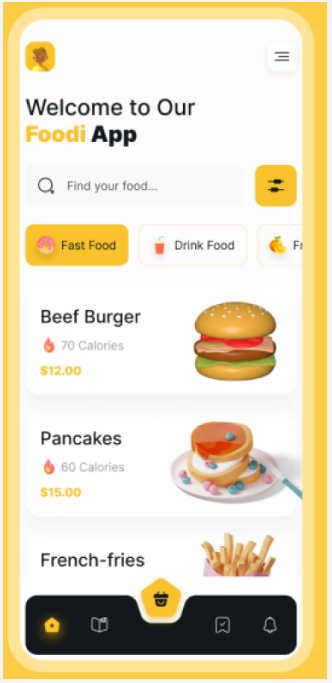
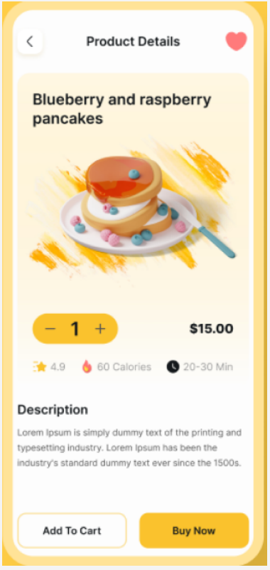

# 🍔 Foodi App

Bem-vindo ao **Foodi App**!  
Este é um projeto experimental feito em **React Native** com Expo, desenvolvido para fins de aprendizado e como entrega de trabalho acadêmico.

## ✨ Sobre o projeto

O Foodi App é um aplicativo de delivery de comida com interface moderna, inspirado em conceitos de UI/UX atuais.  
O objetivo é praticar conceitos de React Native, navegação, estilização e componentes customizados.

---

## 🖼️ Design

### Tela Inicial



### Tela de Detalhes do Produto



---

## 🚀 Como rodar o projeto

1. **Instale as dependências:**
   ```bash
   npm install